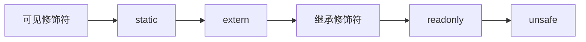

# 测绘程序设计代码规范

[toc]

## 命名规范

### 命名约定

>要在命名空间、类型及成员时采用PascalCasing大小写风格，除非是内部字段和私有字段。
>要用camelCasing大小写风格来命名内部字段和私有字段。
>要用camelCasing大小写风格来命名局部变量。
>要用camelCasing大小写风格来命名方法的形式参数。
>避免给局部变量加前缀。
>方法、事件和委托命名使用动词；其余使用名词
>要使用C#语言中对应的别名，不要使用.NET框架中的类型名。

### 大小写规范

#### 规则1：不同类型标识符的大小写规则

|Identifier | Casing | Example|
|-|-|-|
|Namespace|Pascal|namespace System.Security { ... }
|Type|Pascal|public class StreamReader { ... }
|Interface|Pascal|public interface IEnumerable { ... }
|Method|Pascal|public class Object {<br>　　public virtual string ToString();<br>}|
|Property|Pascal|public class String {<br>　　public int Length { get; }   <br>}|
|Event|Pascal|public class Process {<br>　　public event EventHandler Exited;<br>}|
|Field|Pascal|public class MessageQueue {<br>　　public static readonly  Timeout<br>}<br> public struct UInt32 {<br>　　public const MinValue = 0;<br>}|
|Enum value|Pascal|public enum FileMode {<br>　　Append,<br>　　... <br>}|
|Type parameter<br>generic method|Pascal|public partial class Enum {<br>public static TEnum Parse \<TEnum>(<br>    string value) { ... } <br>}|
|Type parameter<br> generic type|Pascal|public class Task\<TResult> {<br>   ...<br> }
|Tuple element|Pascal|public partial class Range {<br>   public<br>   (int Offset, int Length)<br>   GetOffsetAndLength(<br>     int length) { ... }<br> }
|Parameter|Camel|public class Convert {<br>   public static int ToInt32(string value);<br> }|

#### 规则2：首字母缩写词的大小写

**2.1**: 要把两个字母的首字母缩写词全部大写，除非它是 camelCasing风格的参数名的第一个单词。

```csharp
System.IO;
System.Threading.IOCompletionCallback;
public void StartIO(Stream ioStream)
```

**2.2**: 要把由三个或三个以上字母组成的首字母缩写词的第一个字母大写。只有第一个字母大写，除非首字母缩写词是 camelCasing 风格的标识符的第一个单词。

```csharp
System.Xml;
public void AdjustmentGnss()
public void ProcessHtmlTag(string htmlTag)
```

**2.3**: 不要把 camelCasing 风格的标识符头部的任何首字母缩写词的任何字母大写，无论首字母缩写词的长度是多少。

#### 规则3：复合词和常用术语的大小写

**3.1**: 不要把所谓闭合形式的复合词中每个单词的首字母大写。

**常用的复合词和常用术语的大小写及拼写：**
|Pascal|Camel|Not|
|-|-|-|
| BitFlag | bitflag| Bitflag|
|Callback|callback|CallBack|
|Canceled|canceled|Cancelled|
|DoNot|doNot|Don't|
|Email|email|Email|
|Endpoint|endpoint|EndPoint|
|Filename|filename|FileName|
|Gridline|gridline|GridLine|
|Hashtable|hashtable|HashTable|
|Id|id|ID|
|Indexes|indexes|Indices|
|Logoff|logoff|LogOut|
|Logon|logon|LogIn2|
|Metadata|metadata|MetaData, metadata|
|Multipanel|multipanel|MultiPanel|
|Multiview|Multiview|MultiView|
|Namespace|namespace|NameSpace|
|Ok|ok|OK|
|Pi|pi|PI|
|Placeholder|placeholder|PlaceHolder|
|SignIn|signIn|SignOn|
|SignOut|signOut|SignOff|
|Timestamp|timestamp|TimeStamp|
|Username|username|UserName|
|WhiteSpace|whitespace|Whitespace|
|Writable|writable|Writeable|
|Baseline|baseline|BaseLine|

**注：** When used as a noun (properties, fields, parameters, types). As a verb (methods) it should be considered two words—for example, LogOff

### 单词使用规范

#### 规则4：要为标识符选择易于阅读的名字

eg:一个命为 HorizontalAlignment 的属性就比 AlignmentHorizontal 更易于阅读。

#### 规则5：要更看重可读性，而不是更看重简短性

e.g.:属性名 CanScrollHorizontally 要胜过ScrollableX（不太明显地引用到了X坐标轴）。

#### 规则6：不要使用匈牙利命名法

#### 规则7：避免使用c#的关键字

例如，GetLength这个名字比 GetInt要好。

#### 规则8：不要使用未被广泛接受的首字母缩写词

一个很好的衡量方法是grep测试。只要用搜索引擎在网上搜索该首字母缩写词，如果返回的前几个结果与期望相符，那么该首字母缩写词就有资格被称为众所周知。

### 类、接口、结构的命名规则

#### 规则9：一般类的命名规则

**9.1**：要用名词或名词词组来给类型命名，在少数情况下也可以用形容词词组来给类型命名，
在命名时要使用 PascalCasing 大小写风格。
这使类型名和方法区分开，后者用动词词组来命名。
**9.2**：不要给类名加前缀(例如“C")。
**9.3**：考虑让派生类的名字以基类的名字结尾。(但不必要，按实际情况考虑)

```csharp
public class FileStream:Stream{...}
public class Button:Control{...}
```

**9.4**: 要让接口的名字以字母 **I** 开头，这样可以显示出该类型是一个接口。

```csharp
public interface IComponent{...}
```

#### 规则10：泛型类型参数的命名

**10.1**: 要用描述性的名字来命名泛型类型参数,并且需要加上T前缀。

```csharp
public interface ISessionChannel<TSession> {...}
public delegate TOutput Converter<TInput,TOutput>{TInput from};
```

**10.2**：如果类型只有一个类型参数，且类型参数只有一个字母，考虑用T来命名参数类型。

```csharp
public class List<T>{...} 
pub1ic int IComparer<T> {...}
public delegate bool Predicate<T>(T item) ;
public struct Nullable<T> where T:struct {...}
```

#### 规则11：枚举类型的命名规范

**11.1**：单数名词命名枚举类型，但位域（bit field）使用复数，按照 PascalCasing 大小写风格。

```csharp
public enum ConsoleColor {
    Black, 
    Blue, 
    Cyan,
    ...
}
[Flags]
public enum ConsoleModifiers {
  Alt = 1 << 0,
  Control = 1 << 1,
  Shift = 1 << 2,
}
```

**11.2**: 不要给枚举类型名字添加后缀"Enum"，不要给枚举类型值添加前缀

```csharp
// Bad naming
public enum ColorEnum {
  ...
}
public enum ImageMode {
  ImageModeBitmap = 0, // ImageMode prefix is not necessary
  ImageModeGrayscale = 1,
  ImageModeIndexed = 2,
  ImageModeRgb = 3,
}
//good naming
public enum ImageMode {
  Bitmap = ʘ,
  Grayscale = 1,
  Indexed = 2,
  Rgb = 3,
}
```

### 类型内部的命名规则

#### 规则12：字段的命名规则（公有或受保护字段）

**12.1**：用名词或名词短语来命名字段。

```csharp
public class String {
    public static readonly string Empty;
}
```

**12.2：**[规则3](#规则3复合词和常用术语的大小写)
**12.3**：[规则6](#规则6不要使用匈牙利命名法)

#### 规则13：参数的命名规则

**13.1**：使用具有描述性的参数名，按照参数的意思而不是其类型进行命名

```csharp
public class String {
    pub1ic bool Contains (string value) ;
    pub1ic string Remove(int startIndex， int count) ;
}
```

**13.2：**[规则3](#规则3复合词和常用术语的大小写)

#### 规则14：方法的命名规则

**14.1**：要用动词或动词词组来命名。

```csharp
public class String {
  public int CompareTo(...);
  public string[] Split(...);
  public string Trim();
}
```

#### 规则15：属性的命名规则

**15.1**：要用名词、名词词组或形容词来命名属性

```csharp
public class String {
    public int Length { get; }
}
```

**15.2**：不要让属性名看起来与“Get”方法的名字相似。
注：此情况一般说明该属性实际上是一个方法。

```csharp
public string TextWriter { get {...} set {...} }
public string GetTextWriter(int value) { ... }
```

**15.3**：使用复数短语命名集合属性描述集合中的项，而不用后跟List或collection的单数短语。

```csharp
public class ListView{
    //good naming
    public ItemCollection Items{get;}
    // bad naming
    public ItemCollection ItemCollection { get; }
}
```

**15.4**：考虑用属性的类型名来命名属性。

```csharp
public enum Color {...}
public class Control {
    public Color Color { get; set; }
}
```

#### 规则16：局部变量的命名规范

**16.1**：要用camelCasing大小写风格来命名局部变量。

```csharp
Point tempPoint = new Point();
```

**16.2**：避免给局部变量加前缀。

```csharp
//bad
bool isKnown = true;
//good
bool known = true;
```

**16.3**：变量声明时，要使用C#语言中对应的别名，不要使用.NET框架中的类型名。

```csharp
//bad
Int32 a = 1;
//good
int a = 1;
```

## 注释规范

### 注释应该被用于表达意图、算法和逻辑流程

#### 规则17：不要用注释来描述一些对任何人都显而易见的事

#### 规则18：避免使用块注释语法(/*...*/)，最好是使用单行注释语法(// ...)

```csharp
// Implements a variable-size list that uses an array of objects
// to store the elements. A List has a capacity, which is the
// allocated length of the internal array. As elements are added
// to a List, the capacity of the List is automatically increased
// as required by reallocating the internal array.
//
public class List<T> : IList<T>, IList
{
    ...
}
```

#### 规则19：不要把注释放在行尾，除非注释非常短

```csharp
//Avoid
public class ArrayList
{
    private int count; // -1 indicates uninitialized array
}
```

#### 规则20：在方法前面加上注释标签

```csharp
/// <summary>
/// 计算B中观测方向的误差方程
/// </summary>
/// <param name="Side">该方向对应边</param>
/// <param name="rowIndex">B的行索引</param>
/// <param name="StartIndex">开始点的索引</param>
/// <param name="EndIndex">结束点的索引</param>
/// <param name="AzimuthIndex">方位角索引</param>
void ca_ab(Side Side, int rowIndex, int StartIndex, int EndIndex, int AzimuthIndex){...}
```

## 结构组织规范

### 文件规范

#### 规则21：不要在一个源文件中包含一个以上的公用类型，除非有嵌套类，或各类型之间的不同之处仅在于泛型参数的数量

#### 规则22：要用相同的名字来命名源文件及其包含的公用类型

#### 规则23：为分部类型命名源文件，将主文件的名称和文件内容的逻辑描述用'.'分隔开

e.g.:“JsonDocument.Parse.cs”

#### 规则24：要用相同的层次结构来组织文件目录和名字空间

>例如，应该把System.Collections.Generic.List<T>的源文件
>放在System\Collec-tions\Generic 目录中。

### 代码格式规范

#### 规则25：考虑根据下面给出的顺序和组别来对成员进行分组∶

* 所有字段。
* 所有构造函数。
* 公有属性及受保护的属性。
* 方法。
* 事件。
* 所有显式实现的接口成员。
* 内部成员。
* 私有成员。
* 所有嵌套类型。

#### 规则26：要把不能公开访问的成员和显式实现的接口成员放在分别放在自己的#region块中

#### 规则27：要把using指令放在名字空间的声明之外

#### 规则28：成员修饰符的排序



```csharp
public static extern override readonly unsafe 
protected internal virtual void Reset(){...}
private protected void Reset(){...}
```

#### 规则29：枚举或者对象生成器最后一项需要保留逗号

```csharp
public enum Some
{
    First,
    Second,
    Third,
}
OpenFileDialog fileDialog = new OpenFileDialog()
{
    Filter = "TXT|*.txt",
    Title = "请选择数据文件地址",
    CheckFileExists = true,
};
```

#### 规则30：尽可能使用对象初始化器和集合初始器

示例见[上一条](#规则29枚举或者对象生成器最后一项需要保留逗号)和下列代码

```csharp
Right:
    SomeType someType = new SomeType
    {
        PropA = ...,
        PropB = ...,
        PropC = ...,
    }

Not preferred:
    SomeType someType = new SomeType();
    someType.PropB = ...;
    someType.PropA = ...;
    someType.PropC = ...;
```

#### 规则31：属性和方法的实现基本不会发生变化,请使用自动属性,考虑使用表达体成员

```csharp
public partial class UnseekableStream : Stream
{
    public bool CanSeek => false;
    public override long Seek(long offset, SeekOrigin origin) =>
         throw new NotSupportedException();
}

internal partial class SomeCache
{
    internal long HitCount { get; private set; }
    internal long MissCount { get; private set; }
}
```

尽可能对字段应用只读修饰符。