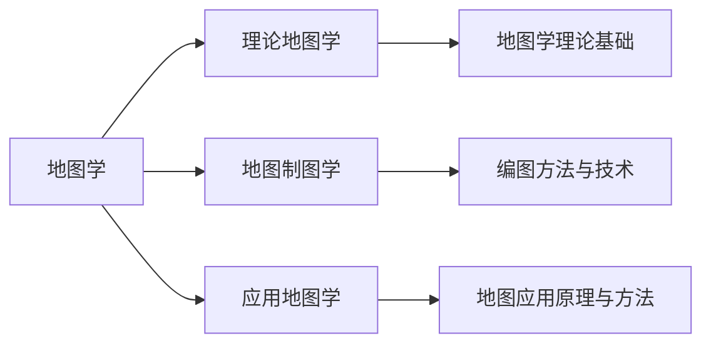

# 导论

[TOC]

## 地图学基础

**地理空间**：上至大气电离层，下至地幔莫霍面，一般指**地球表层**，基准是陆地和海洋表面，是人类生活辐射频繁、人地关系最为复杂、紧密的区域。
**地理空间信息**：地理空间中物质的性质、特征、运动状态的**表征**以及一切有用的*知识*，是对表达地理特征与地理现象(空间现象)之间关系的**地理信息**的解释
**地理信息**：各种地理特征和现象之间关系的表示包括：***空间位置、时域特征、属性特征***

### 什么是地图学

定义：以地理信息的可视化为核心，研究**地图**的理论实质、制作技术和使用方法的综合性科学。
GIS在于信息处理分析，地图学在于信息传输

### 地图学的学科体系

## 地图的基本概念

### 定义

地图是遵循相应的**数学法则**，将地球上的**地理信息**，通过科学的**概括**，并运用**符号系统**表示在一定载体上的图形，以传递它们的数量与质量在时间与空间上的分布规律和发展变化。

### 三大特性

* 可量测性
* 一览性
* 直观性

### 主要特征

* 地理信息的载体（存储大量地理信息）
* 数学法则的结构（地图投影、比例尺、坐标系统）
* 有目的的图形概况（地理信息--地图信息）
* 符号系统的运用（客观事物的抽象表示）

### 构成要素

* 图形要素
* 数学要素
* 辅助要素
* 补充说明

## 地图的功能与分类

### 地图的功能

* 地图信息的载负功能
* 地图的传递功能
* 地图的模拟功能
* 地图的认知功能

### 地图的应用

* 经济建设
* 科学研究
* 国防建设
* 政治、文化教育及日常生活

## 地图的类型

### 按图型分

* 普通地图
* 专题地图
* 专用地图
* 特种地图（地图仪等）

### 按比例尺

* 大
* 中
* 小

### 按区域分

$\cdots $

## 地图的成图方法

* 实测成图
* 编绘成图
* 数字制图
