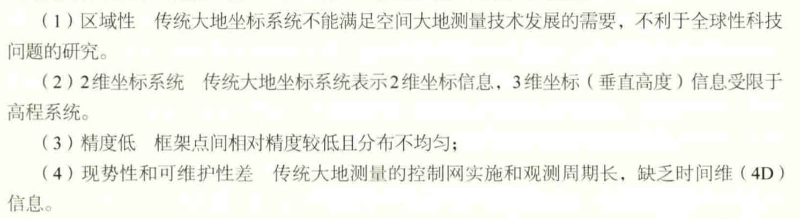
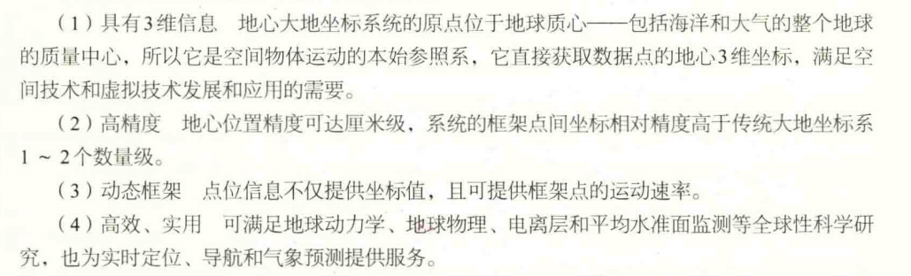
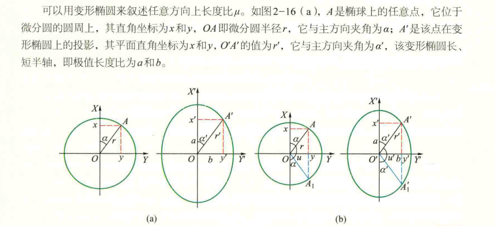

# 地球体与地球投影

[TOC]

## 地球体

### 地球的基本特征

#### 自然表面

#### 物理表面

大地水准面（实际重力等位面）
1.表达了大部分自然表面的形状
2.可用重力场理论研究
3.可获得相对于似大地水准面的高程

#### 数学表面

总椭球体是一个理论上的形体
参考椭球体是各国根据自己的测量数据得到的参考椭球

### 空间参考系

#### 天球坐标系

天文经纬度$(\lambda, \varphi)$

#### 地心坐标系

如CGCS2000,WGS84

#### 大地经纬度

大地经纬度$(L, B, H)$$(\lambda, \varphi, H)$

## 大地测量系统

### 大地坐标系统

#### 传统大地坐标系统

高程基准：

* 1956黄海高程系
* 1985国家高程基准

局限性：

* 区域性
* 2维坐标系统
* 精度低
* 现势性与可维护性差

#### 地心大地坐标系

优点：

* 具有三维信息
* 高精度
* 动态框架
* 高效、实用

## 地图投影

**为什么要地图投影？**
1、地理坐标为球面坐标，不方便进行距离、方位、面积等参数的量算。
2、平面，符合视觉心理，并易于进行距离、方位、 面积等量算和各种空间分析。
3、地球椭球体为不可展曲面。

### 地图投影的概念

**定义：**
球面上一点的位置用地理坐标(经、纬度)表示，平面上用直角坐标或者极坐标表
示，将地球表面上的点转移到平面上，必须采用一定的数学方法来确定地理坐
标与平面直角坐标或极坐标之间的关系。

**实质：**

将地球椭球面上的经纬线网按一定的数学法则转移到平面上来

一般方程为：
$$
\begin{cases}
    x=f_{1}(\lambda, \varphi) \\
    y=f_{2}(\lambda, \varphi)\\
\end{cases}
$$

**地图投影方法：**

* 几何透视法
  * 平行投影
  * 平射方位投影
  * 球心投影
* 数学解析法
  含义：在球面与投影面之间建立点与点的函数关系，通过数学的方法确定经纬线交点位置的一种投影方法。

### 地图投影变形

#### 原因

#### 特征

不同投影变形不同，相同投影，不同位置变形不同

### 变形椭圆

#### 几何方法证明

$$x^{2}+y^{2}=r^{2}$$
以$x=\frac{x^{'}}{m}, y=\frac{y^{'}}{n}$待入得
$$(\frac{x}{m})^{2}+(\frac{y}{n})^{2}=r^{2}$$

>底索定律：无论采用何种转换方法，球面上每一点都至少有一对正交方向，在投影平面上仍能保持其正交关系

以$\mu_{1}$和$\mu_{2}$表示沿主方向的长度比，则
$$(\frac{x}{\mu_{1}r})^{2}+(\frac{y}{\mu_{2}r})^{2}=r^{2}$$
令a=$\mu_{1}r$,b=$\mu_{2}r$则
$$
\begin{cases}
    m^{2}+n^{2}=a^{2}+b^{2} \\
    mn\sin \theta=ab\\
\end{cases}
$$

### 地图投影变形的性质与大小

#### 长度比和长度变形

**长度比：**
投影面上一微小线段ds'和球面上一微小线段ds之比：$\mu=\frac{ds'}{ds}$

**长度变形：**
长度比与1的差值：$V_{\mu}=\mu-1$
长度比和比例尺并不是一个概念

$$
r'= \sqrt{x'^2+y'^2}=\sqrt{a^2x^2+b^2*y^2}=r\sqrt{a^2\cos ^2\alpha+b^2\sin ^2\alpha}
$$
$$
\mu=\frac{r'}{r}=\sqrt{a^2\cos ^2\alpha+b^2\sin ^2\alpha}
$$

#### 面积比和面积变形

投影面上一微小面积dF'和球面上一微小线段面积dF之比：$\mu=\frac{dF'}{dF}$
$$ P=ab=mn\sin \theta $$

#### 角度变形

$$\sin \frac{\omega}{2}=\frac{a-b}{a+b}$$

### 地图投影的分类

#### 按投影的构成方法分类

* 几何投影
  * 方位投影（投至平面）
  * 圆柱投影（圆柱面）
  * 圆锥投影（圆锥面）
  * 多圆锥投影（轴与中央子午线共面，并垂直于中央经线）
* 非几何投影
  * 伪方位投影
  * 伪圆锥投影
  * 伪圆柱投影

#### 按投影的变形性质分类

* 等角投影
* 等积投影
* 等距投影
* 任意投影

### 地图投影的命名

* 投影面和球面的几何位置（正，横，斜）
* 变形性质（等角，等积、任意）
* 投影面和球面相切、相割
* 投影面的种类（如上几何投影）
eg:正轴等角割圆锥投影

### 地图投影公式的确定

#### 圆锥投影一般公式

$$
\rho=f(\varphi),\delta=\alpha\lambda \\
m=-\frac{d\rho}{Md\varphi};n=\frac{\alpha\rho}{N\cos \varphi}
$$

#### 等角正轴割圆锥投影

