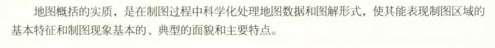
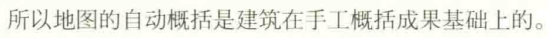
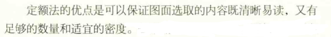
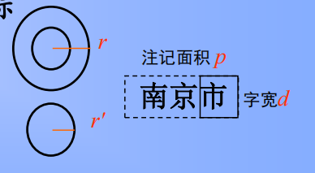
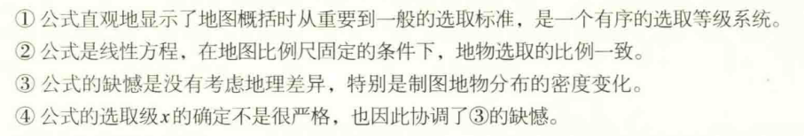
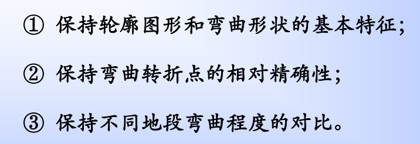
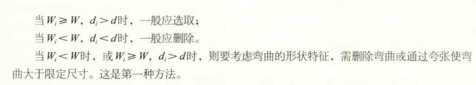

# 地图概括

[TOC]

## 概述

### 实质

**概念：**
用简单的手法，提取空间信息中主要的、本质的数据后联系在一起，形成*新概念地图编制理论和技术的**核心**，贯穿地图制作的全过程，体现地图编制过程中**创造性**的**主要环节***

**实质：**
模拟地图的概括是解决缩小了的地图同庞大、复杂的空间信息之间数量和质量矛盾的主要途径。

**基本原理：**
据地图的用途、比例尺和区域，在保证地图清晰的前提下，压缩地图的面积载负量，保持恰当的信息载负量

### 影响地图概括的因素

* 地图用途与主题对地图概括的影响
* 地图比例尺对地图概括的影响
* 制图区域的地理特征对地图概括的影响
* 制图数据质量对地图概括的影响

### 手工概括和自动概括

现在着重于图形化简，对于属性数据等研究较少

## 地图概括的内容与方法

**最基本的内容：**

* 对地图内容要素的选取（分类）
* 对选取内容要素进行概括（包括对图形要素的简化）

**过程：**

### 地理信息的分类

* 按质量特征分类
  将空间数据按属性合并用详细的分类取代详细分类
* 按数量特征分类
  常依比例尺可以表达的方式进行

### 地理信息的选取

**选取原则：**
整体-->局部、主要-->次要、高级-->低级，大-->小

#### 资格法

排序选取，有数量质量指标，如选取居民点，可以选取数量指标入口数排序，也可以选择行政级别的质量指标

#### 定额法

按地图上单位面积选取对象的个数或密度来确定

#### 区域指标法

#### 确定选取指标的几种数据分析方法

要求：

* 图解计算法

S是居民点面积载负量：
$$ S=n(\pi r^2+3d^2) $$
* 开方根法（由大比例尺地图绘制小比例尺地图）
A为原图，B为新编图
$$ N_{B}=N_{A}CD\sqrt{(\frac{M_{A}}{M_{B}})^{X}} $$
$$ C=\begin{cases}
    1, 点\\
    \sqrt{(\frac{M_{A}}{M_{B}})^{}}，线\\
    \sqrt{(\frac{M_{A}}{M_{B}})^{2}}，面\\
\end{cases} $$
$$ D=\begin{cases}
    1, 一般\\
    \sqrt{(\frac{M_{B}}{M_{A}})^{}}，重要\\
    \sqrt{(\frac{M_{A}}{M_{B}})^{2}}，次要\\
\end{cases} $$
$X$对应$CD$可选0，1，2，3
该公式特点：

### 图形的简化

显示空间信息重要的**本质特征**，删弃次要的**非本质特征**

课件

* 质量特征的简化
  空间数据按其属性进行合并
* 数量特征的简化
  合并量表
* 地物轮廓特征的简化
  **基本要求：**
  
  **方法：**
  1.
  2.按开方根规律简化形状
  如河流，在新编地图上对转折角或弯曲数进行开方根计算
* 地物内部结构的简化（合并与分割）
  * 合并，合并同类地物，突出结构特征
  * 分割，应用于不太重要地物的拆分

### 图形的夸张

——提高或强调图形符号的**重要特征**

* 不依比例尺放大
* 移位

### 地图概括对地图精度的影响

(1) 地图描绘产生的误差
(2) 符号移位产生的误差
(3) 形状概括产生的误差

### 地图概括的原则

(1) 符合地图用途的需要
(2) 保持地图清晰易读且内容完备
(3) 保证一定的地图精度
(4) 反映出制图区域地理特征

### 不同分布特征专题现象的概括

#### 点状分布

数量特征的概括（缩减分级）、质量特征的概括（类别合并或取消要素的质量特征），个别要素、物体的选取

#### 线状分布

简化形状特征、简化路径的表示

#### 连续面状分布

等值线法表示数量特征（扩大等值线的间距值，从而缩减分级；选取特征等值线和简化等值线的轮廓）；质地法或范围法表示质量特征（简化现象的分类）

#### 离散面状分布

点值法（扩大点值）；分级统计图法和分区统计图表法（扩大分
级间隔，区划合并）

#### 动态现象

运动线法（简化路线形状）；简化数量特征（缩减分级）；简化质量特征（减
少分类）；选取主要（舍弃次要的路线
