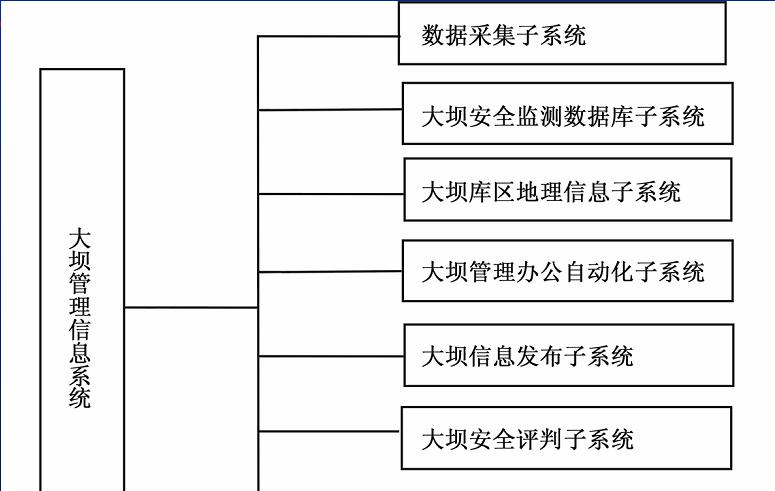

# 工程建设中的测量工作与信息管理

## 工程规划设计阶段的测量工作

在此阶段的测量工作，主要是提供各种比例尺的地形图供规划设计人员进行规划设计。

### 工业企业规划设计阶段的测量工作

工业企业是面状地形，因此它所需的图具有面状特征，要进行规划设计必须有设计底图，而该阶段测量工作的任务是向设计者提供所需的地形图  。一般来说:

>* 1：5000比例尺地形图可用于规划设计；
>* 1：2000比例尺地形图可用于初步设计；
>* 1：1000比例尺地形图可用于施工设计；
>* 1：500比例尺地形图可用于地形复杂、建筑物密集、精度要求较高的工业企业的施工设计。

### 线路规划设计阶段的测量工作

我国铁路规划设计的程序，一般要经过方案研究、初测、初步设计、定测，施工设计等过程。勘测工作分为初测和定测两个阶段进行

### 桥梁规划设计阶段的测量工作

桥位平面和高程控制测量
桥址定线测量
断面测量
桥位地形测量
流向测量
船筏走行线测量
钻孔定位

## 工程施工建设阶段的测量工作

工程施工阶段的测量工作主要是按设计要求将设计的建构筑物位置、形状、大小及高程在实地标定出来，以便进行施工；另一方面作为施工质量的监督，还需进行工程质量监理测量。

### 施工测量工作

不同的对象，工作程序基本上是一致的
**主要的测量工作有：**
施工控制网的建立
施工放样
竣工测量

**施工平面控制网（按施工对象不同选择）：**
建筑方格网的定义及其应用
导线网
边角网
GNSS网

### 监理测量工作

* 在正式施工开始时，对控制网进行全面复测、检查
* 验收承包人的施工定线
* 验收承包人测定的原始地面高程
* 对桥梁施工还需进行桥梁下、上部结构的施工放样
的检测
* 对每层路基的厚度、平整度、宽度、纵横坡度进行
抽查，检查施工单位的内业资料是否真实
* 审批承包人提交的施工图

## 工程营运管理阶段的测量工作

工程运营管理阶段测量工作的主要任务是工程建筑物的**变形观测**。在工程建筑物运营期间，为了监视其**安全和稳定**的情况，了解其设计是否合理，验证设计理论是否正确，需要定期对其位移、沉降、倾斜以及摇摆等进行观测，称为变形观测。

## 工程建设中的测量信息管理

### 现状

工程建设的各个阶段都存在着测量信息的管理问题。目前，我国工程建设中测量信息管理的现状还较落后，加强测量信息的管理，实现各种测量信息从**采集、处理、更新到管理**的一体化、自动化、智能化、网络化和数字化，是工程建设对测绘信息管理工作的新要求。

### 信息处理与管理

#### 信息采集方法

* 测量仪器；
* 数字化仪自动或手动扫描采集；
* 摄影测量方法

#### 信息处理

* 信息传输
* 信息加工
* 信息存储

### 信息管理

* 信息分类：线分类法和面分类法
* 信息编码是信息资源管理的重要组成部分。

### 信息系统设计

#### 数据库设计

* 数据库结构
* 数据库设计
• 数据库的逻辑模式设计
• 用户权限的设计
• 索引文件的设计
• 中间文件或临时文件的设计
• 视图的设计

#### 输入／输出及界面设计

* 输入设计
* 输出设计

#### 工程信息管理系统及应用

