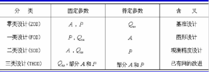

# 工程测量网布设的理论与方法

[toc]

## 工程测量网的分类和作用

### 工程测量网的分类

* 按范围, 全球控制网, 国家控制网, 工程控制网
* 按用途, 测图控制网, 施工控制网, 变形监测网, 安装控制网
* 按网点性质, 一维网, 二维网, 三维网
* 按网型, 三角网, 导线网, 混合网, 方格网
* 按施测方法, 测角网, 测边网, 边角网, GNSS网
* 按坐标系和基准分, 附合网, 独立网, 经典自由网, 自由网
* 其他标准, 首级网, 加密网, 特殊网, 专用网（如隧道控制网、建筑方格网、桥梁控制网等

### 工程控制网的建网步骤

1. 确定控制网等级
2. 确定布网形式
3. 确定测量仪器和操作规程
4. 在图上选点构网，到实地踏勘
5. 埋设标石、标志
6. 外业观测
7. 内业数据处理
8. 提交成果

### 测图控制网

作用：
控制测量误差的累积；
保证图上内容的精度均匀；
相邻图幅正确拼接

### 施工控制网

类别：三角、边角网、导线网、建筑方格网、GNSS网、GNSS网与地面网相结合的混合网
**特点：**

1. 控制的范围较小，控制点的密度较大，精度要求较高；
2. 使用频繁；
3. 受施工干扰大；
4. 控制网的坐标系与施工坐标系一致；
5. 投影面与工程的平均高程面一致；
6. 有时分两级布网，次级网可能比首级网的精度高。

### 变形监测网

**要点：**

* 变形监测网由参考点和目标点组成；
* 变形监测网的坐标系和基准的选取原则；
* 对变形监测网应作同时顾及精度、可靠性、灵敏度以及费用进行监测网的优化设计；
* 对变形监测网都要进行重复观测。

### 安装测量控制网

特点：

* 通常是一种微型边角网，边长从几米至一百多米
* 整个网由形状相同、大小相等的基本图形组成
* 精度要求很高，其测量精度有时要达到计量级

## 工程控制网的基准和建立方法

### 工程控制网的基准

* 约束网：具有多余观测
* 最小约束网（经典自由网）：只有必要观测
* 无约束网（自由网）：观测数小于必要观测数

### 工程控制网基准的建立方法

**测图控制网**多为**约束网**，总是选国家会城市坐标系（含平面和高程）下的已知点坐标为其**基准**。

## 工程控制网的质量准则

### 精度准则

总体精度准则

1. E准则 置信超椭球的最大半轴应尽可能地小$\lambda_{max}=min$
2. 体积准则 置信超椭球的体积应尽可能地小$\det \Sigma_{xx}=min$
3. 方差准则 置信超椭球的半轴平方和应尽可能地小 tr=min
4. 平均精度准则
5. 均匀性和各向同性准则

点位精度和相对点位精度
未知数函数的精度
主分量
准则矩阵

### 可靠性准则

定义：
控制网**发现（或探测）**观测值**粗差的能力**（称内部可靠性）和**抵抗观测值粗差**对平差结果**影响的能力**（称外部可靠性）。
作用：
可靠性准则可以提供衡量控制网内部观测值相互控制、检核的量化数值和可能出现但不能被发现的最大模型误差值。

提高实现质量的方法：

* 对网进行第二次独立观测（复测）
* 布网时事先考虑用独立的附加观测值来控制网的结构（较常用）

使用多余观测分量评价
特点：

1）0 ≤ ri ≤ 1。 ri越小， 该观测值在网中地位越高，若ri等于零，则该观测值不可缺少，否则产生形亏。ri 越大,该观测值在网中地位越低，若ri等于1，则该观测值完全多余，即使删除了，其网平差结果也不变。
2）观测值的内部可靠性与观测值精度成反比。对于一个确定的网和设计方案，观测值的精度愈高，相应的ri越小，则其内部可靠性愈低； 观测值的精度愈低，相应的ri越大，观测值内部可靠性与观测值精度成反比。
3）多余观测数r愈大，则观测值的ri也越大，网的可靠性愈高，建网费用也愈高。
4）对于独立网来说，观测值的内部可靠性是与基准的位置无关的不变量。
5）一个好的控制网，观测值的多余观测分量应大于0.3-0.5。

### 灵敏性准则

### 费用准则

最大准则、最小准则，用观测的权的函数来度量

## 工程控制网的优化设计

### 工程控制网的优化设计分类

网的优化设计是一个迭代求解过程,它包括
以下内容：

* 提出设计任务；
* 制定设计方案；
* 进行方案评价；
* 进行方案优化。
