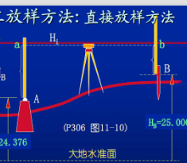
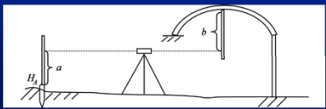
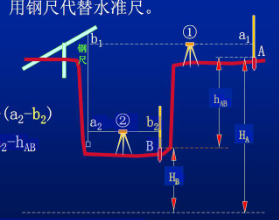
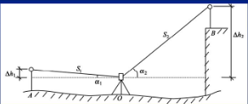
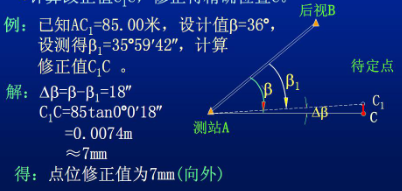
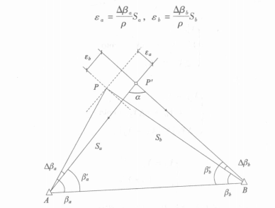

# 工程建筑物的施工放样

## 概述

将平面位置和高程按设计要求，以一定的精度在实地标定出来

## 建筑限差和精度分配

精度分配一般线采用：等影响原则、按比例分配原则、忽略不计原则

## 常用的放样方法

### 直接放样法

1. 高程放样-水准仪法

钢尺代替水准尺
全站仪无仪器高作业法放样

2. 角度放样
经纬仪正倒镜分中法

3. 距离放样
钢尺法
电磁波测距

4. 点位放样（现场至少有一基线）
直角坐标法：（建筑物轴线放样、建筑方格网的建立）
极坐标：计算角度与距离分别放样
角度交会法：分别放两个方向，然后打桩交会出放样点
距离交会法： 通常待定点P离已知点A、B不超过一尺段，地面平坦，便于钢尺作业。
铅垂线放样：垂球（精度低），使用铅垂仪

### 归化法放样

1. 角度
先初步放样，然后多测回观测获得该点的精确位置，与待放样量比较，获得改正量，通过改正获得放样点

2. 点位

3. 直线
测小角归化法：
测大角归化法：

4. 构网联测归化法放样在高精度的施工放样中，控制点通常采用带有强制对中盘的观测墩。通过构网联测平差后，将控制点归化到**某一特定的方向**或几个特定位置，便于架仪器直接放样。同样也可以将**控制点与直接放样点一起构网联测**，经平差后，求得各直接放样点的归化量，再将放样点归化到设计位置。

### 刚体的放样定位

一个刚体在三维空间中有六个自由度，即三个平移量X、Y、Z和分别绕x、y、z轴旋转的三个量αx、αy、αz。要确定刚体在三维空间中的位置，也就是要固定这六个自由度。

## 曲线测设

偏角法
切线支距法

