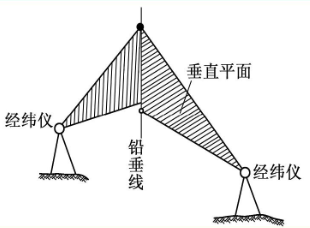

# 工程的变形监测和数据处理

## 变形监测的基础知识

变形监测：是监视对象或者物体进行测量，以确定其空间位置随数据的变化特征
包括全球性、区域性、和工程的变形监测

实用意义：保障了施工的安全
科学意义：1.解释变形机理2.验证变形的假说3.检验设计是否合理4.为修改设计、制定规范提供依据

刚体的位移、自身的形变

特点：

1. 要进行周期观测，前网型、仪器、方法以及人员要尽可能一致
2. 动态、持续监测
3. 要求精度高

参考点、目标点及其它们之间的连接称为变形体的几何模型。
变形体空间上的离散化：监测点（目标点）
时间上的离散化：周期性监测、持续性监测
相对定位、绝对定位
参考点、目标点
不变量、可变量

## 变形监测方案设计

制定标准：
1.所需的精度2.观测周期数3.两周期之间的时间间隔4.一周期所允许的观测时间
变形值不超过某一允许的数值而确保建筑物的安全，则其观测的中误差应小于允许变形值的1/10～1/20；如果观测的目的是为了研究其变形的过程，则其中误差应比这个数小得多。”

## 变形监测方法和自动化

### 大地测量方法，适合长周期

变形监测网、几何水准、电磁波测距三角测量

### 摄影测量方法

特点：
不接触监测的变形体
外野工作量小、观测时间短，快速，点多
信息量大，利用率高，利用种类多
仪器费用较高，数据处理对软硬件的要求较高

### 特殊的大地测量方法

短距离和距离变化测量方法：
距离小于50m ，可采用机械法。
精确地获取被测对象的变化，对被测对象本身的精度，要求不是很高
短距离和距离变化测量方法
机械法
偏离水平基准线的微距离测量：
准直法
光学法：光学法测小角$l_i=\frac{\alpha_i}{\rho}S_i$
光电法
机械法：在基准点上吊挂钢丝或尼龙丝构成基准线，用**测尺游标、投影仪或传感器**测量中间目标点相对于基准线的偏距
偏离垂直基准线的微距离测量
铅直法
以过基准点的铅垂线为垂直基准线，测量沿铅垂基准线上的目标点相对于基准线的水平距离(亦称偏距)的方法
光学法：
机械法：正倒垂线法，正垂线中午在下使用重力拉直，倒垂线在上，使用浮力拉直
液体静力水准测量法：$P+\rho gh=C$该法特别适合建筑物内部(如大坝)的沉降观测
挠度曲线和倾斜测量
相对于水平或铅垂基准线的弯曲线称挠度曲线。
曲线上某点到基准线的距离称为挠度。
挠度曲线及其随时间的变化可通过倾斜测量或正倒垂线法获得
两点之间的倾斜也可采用测量高差（或水平位移）和两点间距离，通过计算间接获得。
裂缝观测
确定裂缝位置、走向、长度、宽度等。对于建筑预留缝和岩石裂缝，一般预埋内部测微计和外部
测微计。
振动观测:一般采用光电测量系统和全球定位系统作持续动态观测。
三维激光扫瞄测量
为什么要进行自动化：
1.变形速度太快2.监测点太多3.监测间隔太短4.监测环境太恶劣5.监测不能影响生产和运行管理

## 数据处理

1. 监测网的周期观测数据处理
2. 各监测点上的监测数据处理
3. 变形分析（几何分析、物理解释）
4. 变形预报

### 变形监测点的数据处理

回归分析法：
1）回归分析既是一种统计计算方法，又是一种变形的物理解
释方法。
2）若只是两个变量之间的问题，即一个自变量的情况，称一
元回归。变形值和时间之间也可作回归分析。
3）若两个变量之间存在线性函数关系，则为直线回归。若两
个变量是非线性关系，有两种处理方法：
（1）根据散点图和常见的函数曲线(如双曲线、幂函数曲线、
指数曲线、对数曲线)进行匹配，通过变量变换把曲线问题
化为直线问题；
（2）用多项式拟合任一种非线性函数，通过变量变换把一元
非线性回归问题化为多元线性回归问题。
残差平方和 Q
回归平方和 U
总离差平方和 S
$S=Q+U$
总离差平方和为变形观测值与变形观测值的平均值之差的平方和，残差平方和为变形观测值与变形观测值的回归值之差的平方和，回归平方和为变形观测值的回归值与变形观测值的平均值之差的平方和。
逐步回归算法的步骤
(1)   初选变形影响因子；
(2)   确定首选的一元线性回归方程；
(3)   确定最佳二元线性回归方程；
(4)   确定最佳三元线性回归方程；
(5)   确定最佳回归方程。

1) 逐步线性回归模型需要有较长且一致性较好的观测值序列。
2) 当环境量之间相关性较大，可采用岭回归分析；
3) 如果考虑测点上有多个效应量，如三向垂线坐标仪、双向引张线仪，二向、三向测缝计的观测值序列，则可采用偏回归模型
4) 偏回归模型具有多元线性回归分析、相关分析和主成份分析的功能，在某些情况下优于一般的逐步线性回归模型。
