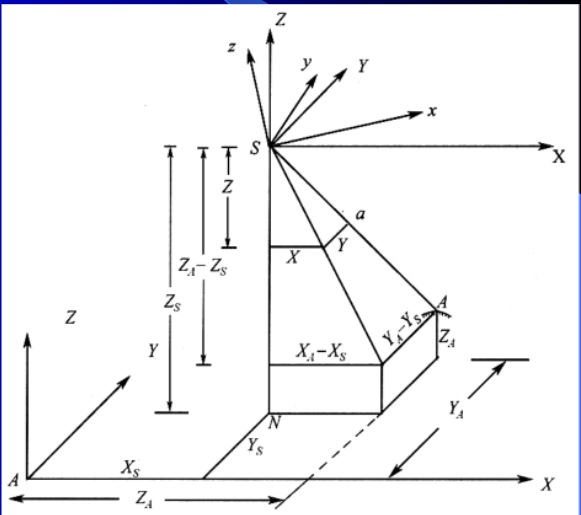

# 共线方程

$$\frac{X}{X_{A}-X_{S}}=\frac{Y}{Y_{A}-Y_{S}}=\frac{Z}{Z_{A}-Z_{S}}$$

$$\because \begin{bmatrix} X \\ Y \\ Z \\\end{bmatrix}=R\begin{bmatrix} x \\ y \\ -f \\\end{bmatrix}$$

$$
\begin{bmatrix} X \\ Y \\ Z \\\end{bmatrix}=\frac{1}{\lambda}\begin{bmatrix} X_{A}-X_{S} \\ Y_{A}-Y_{S} \\Z_{A}-Z_{S}\\\end{bmatrix}
$$

$$ R^{-1}=R^{\mathsf{T}} $$

$$\therefore \begin{bmatrix} x \\ y \\ -f \\\end{bmatrix} =\frac{R^{\mathsf{T}}}{\lambda}\begin{bmatrix} X_{A}-X_{S} \\ Y_{A}-Y_{S} \\Z_{A}-Z_{S}\\\end{bmatrix}$$

第一行和第二行分别和第三项相除
得到共线方程：
$$x=-f\frac{(X)}{(Z)}\\ y=-f\frac{(Y)}{(Z)}$$
