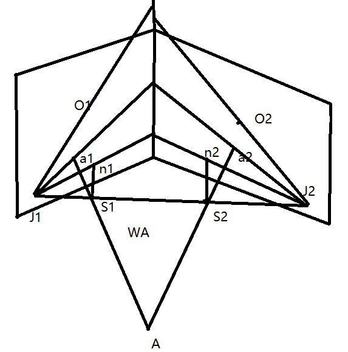
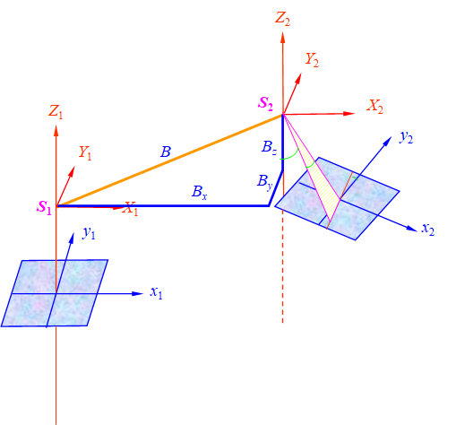
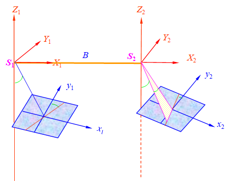

# 双像解析摄影测量

## 双像解析摄影测量概念

按立体像对与被摄物体的几何关系，以数学计算方式，通过计算机解求被摄物体的三维空间坐标
立体像对：由不同摄站获取的，具有一定影像重叠的两张像片。

**几何模型：**
根据摄影过程的几何反转原理，恢复了立体像对的内方位和相对方位后，所有同名光线成对相交。由无数同名光线相交交点构成的与实地相似的几何表面。

### 立体像对中特别的点、线、面

## 前方交会

获取已知数据$x_0,y_0，f,X_{S1},Y_{S1},Z_{S1},X_{S2},Y_{S2},Z_{S2},\varphi_1,\omega_1,\kappa_1,\varphi_2,\omega_2,\kappa_2$
量测像点坐标 $x_1,y_1,x_2,y_2$
由外方位线元素计算基线分量  $B_X,B_Y,B_Z$
由外方位角元素计算像空间辅助坐标  $X_1,Y_1,Z_1,X_2,Y_2,Z_2$
计算点投影系数 $N_1,N_2$
计算地面坐标 $X_A,Y_A,Z_A$

## 相对定向与绝对定向

同名射线对对相交。实质是恢复核面，即同名射线与基线共面，解析法相对定向恢复核面，需要从共面条件方程出发解求五个相对定向元素，才能建立地面立体模型。
**相对定向元素**：确定立体像对中两张像片相对位置和姿态关系的参数，称之为相对定向元素。
**目的：** 建立几何模型

### 连续法

### 单独法

$$
X_{mp}=mN_1X_1\\ Y_{mp}=\frac{1}{2}(N_1Y_1+N_2Y_2+b_y)\cdot m\\
Z_{mp}=mf+mN_1Z_1
$$

### 绝对定向

要确定立体模型在实际物空间坐标系中的正确位置，则需要把模型点的摄影测量坐标转化为物空间坐标。这种坐标系的变换，称之为立体模型的绝对定向。

* 获取控制点的两套坐标$X_p,Y_p,Z_p,X_{tp},Y_{tp},Z_{tp}$
* 给定绝对定向元素的初值 $\lambda=1,\Phi=\Omega=\Kappa=0,X_0,Y_0,Z_0$
* 计算重心化坐标
* 计算误差方程式的系数和常数项
* 解法方程，求绝对定向元素改正数
* 计算绝对定向元素的新值
* 判断迭代是否收敛
