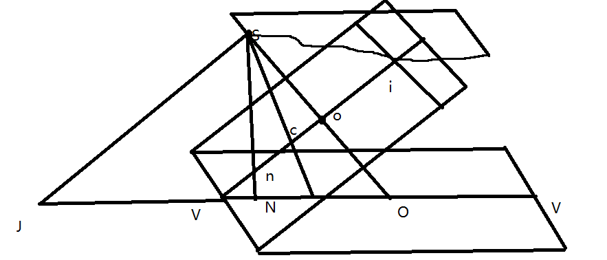
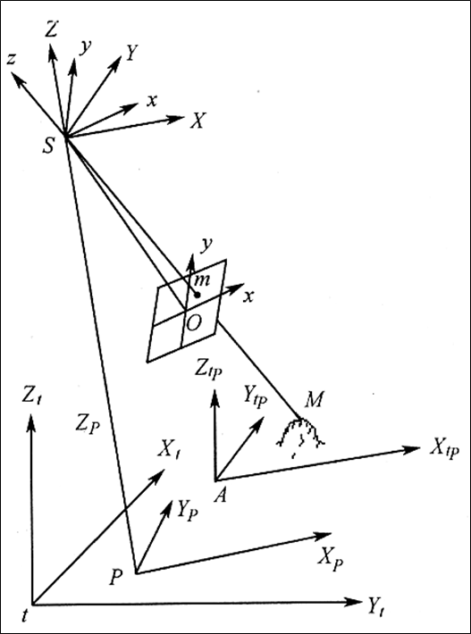

# 单像解析

## 中心投影与投射变换

### 航测图与地形图的区别

* 投影方式不同
* 比例尺不同
* 航测像片存在像点位移
* 表达内容不同
* 表达方式不同
* 几何不同

### 重要的点线面

**等角性的特性：** 当地面为水平时，取等角点c和C为辐射中心，在像平面和地面上向任意一对透视对应点所引绘的方向，与相应的对应起始线之间的夹角是相等的
**等比线的特性：** 等比线的构像比例尺等于水平像片的摄影比例尺f/H

## 摄影测量的坐标系

* 框标坐标系
* 像平面直角坐标系
* 以主纵线为y轴的坐标系
* 像空间直角坐标系
* 像空间辅助坐标系
* 摄影测量坐标系
* 地面摄影测量坐标系
* 大地坐标系

## 内外方位元素

### 内方位元素

确定摄影物镜后节点相对于像片平面的关系

### 外方位元素

在恢复像片内方位元素的基础上，确定像片摄影瞬间在地面直角坐标系中空间位置和姿态的参数，称为像片的外方位元素。如果已知像片的外方位元素，就能恢复像片在空间的位置和姿态。
直线元素：$X_S\quad Y_S\quad Z_S$
角元素：$\begin{cases}
    \varphi,\omega,\kappa\quad Y轴\\ \varphi',\omega',\kappa' \quad X轴\\A,\alpha,\kappa_v \quad Z轴
\end{cases}$

## 共线方程

[推导](推导共线方程.md)
