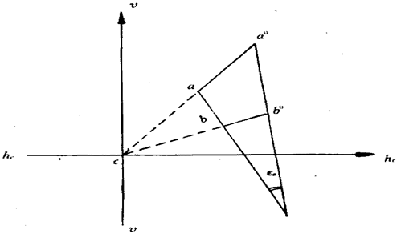
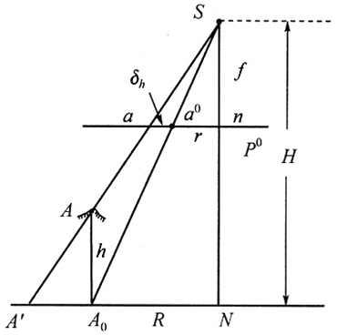
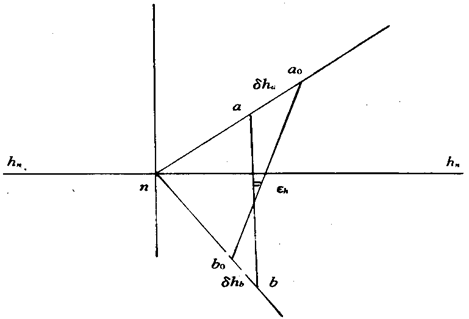

# 单像解析

## 中心投影与投射变换

### 航测图与地形图的区别

* 投影方式不同
* 比例尺不同
* 航测像片存在像点位移
* 表达内容不同
* 表达方式不同
* 几何不同

### 重要的点线面

**等角性的特性：** 当地面为水平时，取等角点c和C为辐射中心，在像平面和地面上向任意一对透视对应点所引绘的方向，与相应的对应起始线之间的夹角是相等的
**等比线的特性：** 等比线的构像比例尺等于水平像片的摄影比例尺f/H

## 摄影测量的坐标系

* 框标坐标系
* 像平面直角坐标系
* 以主纵线为y轴的坐标系
* 像空间直角坐标系
* 像空间辅助坐标系
* 摄影测量坐标系
* 地面摄影测量坐标系
* 大地坐标系

## 内外方位元素

### 内方位元素

确定摄影物镜后节点相对于像片平面的关系

### 外方位元素

在恢复像片内方位元素的基础上，确定像片摄影瞬间在地面直角坐标系中空间位置和姿态的参数，称为像片的外方位元素。如果已知像片的外方位元素，就能恢复像片在空间的位置和姿态。
直线元素：$X_S\quad Y_S\quad Z_S$
角元素：$\begin{cases}
    \varphi,\omega,\kappa\quad Y轴\\ \varphi',\omega',\kappa' \quad X轴\\A,\alpha,\kappa_v \quad Z轴
\end{cases}$

## 共线方程

[推导](推导共线方程.md)

### 线性化

求偏导数

## 像点位移、方向偏差及航摄像片的构像比例尺

### 地面水平时像片倾斜引起的像点位移与方向偏差

#### 像片倾斜引起的像点位移

**定义：**
某地面点在航摄像片上的构像位置，相对于同摄站同摄影机摄取的水平像片上构像位置的差异称为因像片倾斜引起的像点位移。
**特性：**
倾斜像片上像点位$\delta_\alpha$移出现在以等角点为中心的辐射线上。像片边缘倾斜误差大于像片中心倾斜像片的像点位移是以误差值表示的，其值与$\sin \varphi$的符号有关。当$\varphi$＝0°或180°时，像点位于等比线上，无像片倾斜像点位移；当$\varphi$＝90°或270°时，此时$\sin \varphi$=±1，此时主纵线上的像点位移为最大值。

#### 像点倾斜引起的方向偏差

地面点A，B在水平像面上的构像为a',b',实际构像为a,b,两线夹角$\delta_\alpha$即为方向偏差
其在等角点的射线上两点连线无方向变形

### 像片水平时地形起伏引起的投影差、像点位移及方向偏差

#### 因地形起伏引起的投影差和像点位移

图中的$a_0a$即为因地形起伏引起的像点位移，用$\delta_h$表示
**特征：**

* 地形起伏像点位移是地面点相对于所取基准面的高差而引起的。
* 水平像片上存在有地形起伏像点位移δh ，以误差值表示。
* 像点位移表现在以像底点为中心的辐射线上，当h为正时，背离像底点方向位移。当h为负时，朝向像底点方向位移。
* 位于像底点处的像点不存在像点位移。
* 在保持像片摄影比例尺不变时，地形起伏像点位移之值随航高的增大而减小；因此采用长焦距摄影机以增大航高进行空中摄影是有利的。
* 在航摄像片上由像底点引出的辐射线不会出现因地形起伏像点位移引起的方向偏差。

#### 因地形起伏引起的方向偏差

对基准面具有高差的任意两地面点的像点，其连线方向相对该地面点在基准面上正射投影点的像点的连线方向的偏差

以像底点为中心的辐射方向线上任意两点的连线不存在地形起伏引起的方向偏差

### 航摄像片的构像比例尺

摄影测量中通常提到的像片比例尺，只是个概值，一般是指作为摄影计划而设计的摄影比例尺。

## 空间后方交会

地面点坐标是已知值，像点坐标是观测值，外方位元素是未知值
由控制点求取外方位元素

1. 获取已知数据：从摄影资料中查取像片比例尺，平均航高，内方位元素；从外业测量成果中，获取控制点的地面测量坐标并转换为地面摄影测量坐标；
2. 量测控制点的坐标：将控制点标刺在像片上，利用立体坐标量测仪量测控制点的像框标坐标系坐标，并经像主点坐标改正，得到像点坐标x, y；
3. 确定未知数的初始值：在竖直摄影的情况下，角元素的初始值为0，即$\varphi=\omega=\kappa=0$。线元素中，取值可用四个角上的控制点坐标的平均值，即:
$$ Z_{S_0} =mf+\frac{\sum_{}Z}{n}\\X_{S_0} =\frac{\sum_{i=1}^4X_i}{4}\\Y_{S_0} =\frac{\sum_{i=1}^4Y_i}{4}$$
4. 用三个角元素的初始值计算旋转矩阵R；
5. 用所取未知数的初始值和控制点的地面坐标，代入共线方程式，逐点计算像点坐标的近似值(x),(y) ；
6. 组成误差方程式；
7. 计算法方程式的系数矩阵与常数项，组成法方程式；
8. 解算法方程，迭代求得未知数的改正数（外方位元素）。

## 像对的的立体观察和立体量测

观察人造立体的条件：

* 由两个不同摄站点摄取同一景物的一个立体像对
* 一只眼睛只能观察像对中的一张像片（分像条件）
* 两眼各自观察同一景物的左、右影像点的连线应与眼基线近似平行（平行条件）
* 两像片的比例尺相近，差别<15 ％ （尺度条件）
* 像片间的距离应与双眼的交会角相适应
