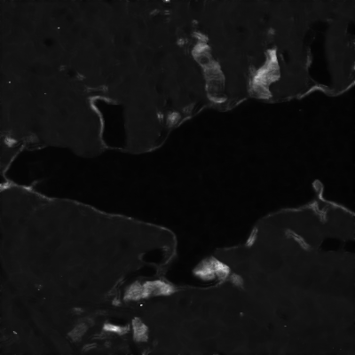
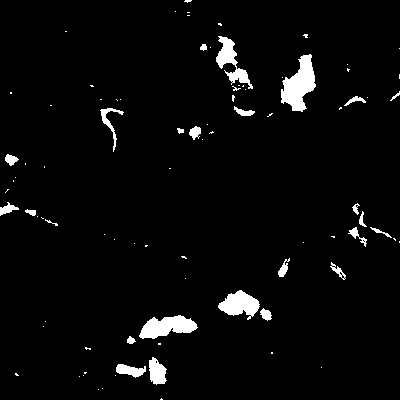
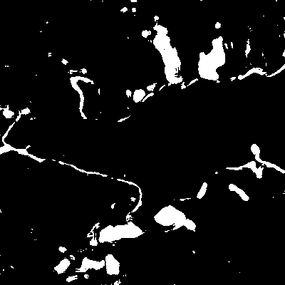
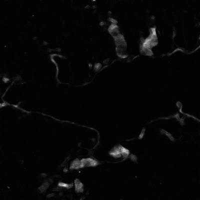
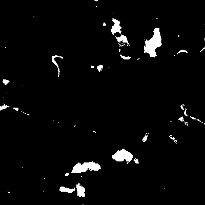
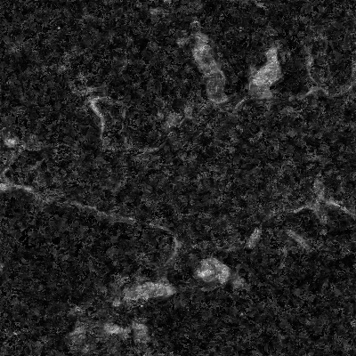
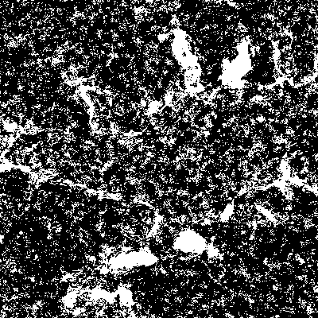
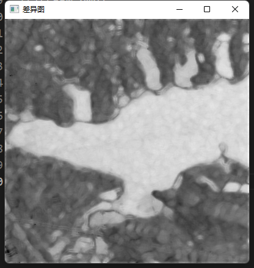

---
# try also 'default' to start simple
theme: seriph
# random image from a curated Unsplash collection by Anthony
# like them? see https://unsplash.com/collections/94734566/slidev
background: https://source.unsplash.com/collection/94734566/1920x1080
# apply any windi css classes to the current slide
class: 'text-center'
# https://sli.dev/custom/highlighters.html
highlighter: shiki
# show line numbers in code blocks
lineNumbers: false
# some information about the slides, markdown enabled
info: |
  ## Slidev Starter Template
  Presentation slides for developers.

  Learn more at [Sli.dev](https://sli.dev)
# persist drawings in exports and build
drawings:
  persist: false
# use UnoCSS
css: unocss
---

# 测度实验

---

# wishart_distance

$d_W(C,\Sigma_m)=\log{|\Sigma_m|}+\operatorname{tr}(\Sigma_m^{-1} C)$
差异图:

结果图:

||变化 |未变化|
|-|-|-|
|变化|5458| 307|
|未变化|9372|144863|
$FA = 0.00211476\\
OA = 0.939506\\
Kappa = 0.937045$

---

# bartlett_distance

$d_B(\Sigma_x,\Sigma_y)=2\log \frac{|(\Sigma_x+\Sigma_y)/2 |}{\sqrt{|\Sigma_x||\Sigma_y|}}$

||变化|未变化|
|-|-|-|
|变化|10088|1820|
|未变化|4742|143350|
$
FA=0.012537\\
OA=0.958987\\
Kappa=0.958664$

---

# revised Wishart距离

$d_{RW}(\Sigma_x,\Sigma_y)=\log {\frac{|\Sigma_x|}{|\Sigma_y|}}+\operatorname{tr}(\Sigma_x^{-1}\Sigma_y)-p$

||变化|未变化|
|-|-|-|
|变化|5157|233|
|未变化|9673|144937|
FA=0.00160501
OA=0.938088
Kappa=0.93544

---

# symmetric_revised_wishart_distance

$d_{SRW}(\Sigma_x,\Sigma_y)=\frac{1}{2}(\operatorname{tr}(\Sigma_x^{-1}\Sigma_y)+\operatorname{tr}(\Sigma_y^{-1}\Sigma_x))-p$

||变化|未变化|
|-|-|-|
|变化|5692|333|
|未变化|9138|144837|
FA=0.00229386
OA=0.940806
Kappa=0.938482

---

# log-Euclidean Riemannian metric

$d_{LE}(\Sigma_i,\Sigma_j)=||\log \Sigma_i-\log \Sigma_j||_F$

||变化|未变化|
|-|-|-|
|变化|11324|31925|
|未变化|3506|113245|
FA=0.219915
OA=0.778556
Kappa=0.77495

---

