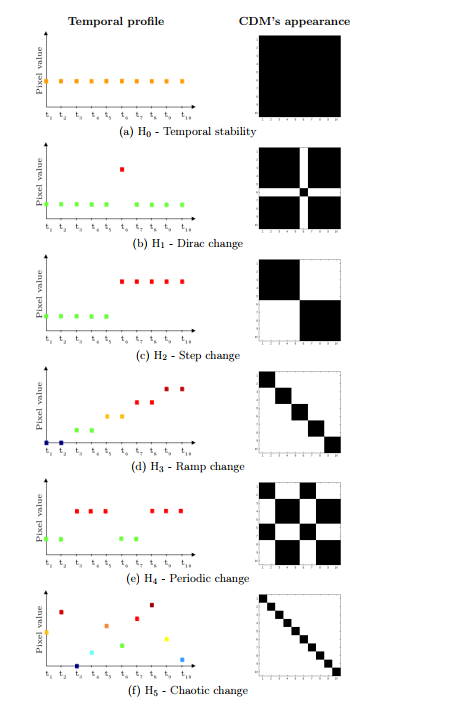

Access to time-series allows for the enrichment of information. Many studies on SAR time-series concern natural surfaces, with the objective of clustering, flood mapping [14], or crop mapping [15,16,17] by using coherent or incoherent methods, with or without machine learning.

First, because using a higher number of images enables improving the robustness of single bi-date change detection [20]. Second, because the temporal information can help to discriminate different classes of change and, thus, contribute to the characterization of changes [21].

