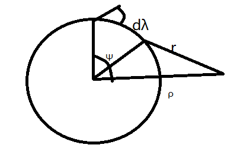
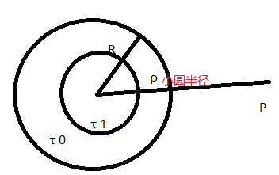
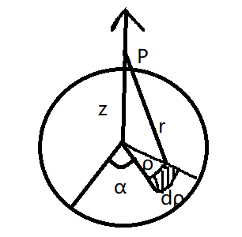

# 几种经典形体的引力位

[TOC]

## 均质球面的引力位和引力

### 外部引力位

$$ V_e=f\mu\int_{\sigma}^{} \frac{1}{r} \mathrm{d}\sigma $$
余弦定理得得到$\Psi$和r的关系：
$$ d\sigma=R\sin\Psi d\lambda \cdot Rd\Psi =R^2\sin\Psi d\Psi d \lambda$$
$$ V_e=2\pi f\mu\int_{\rho-R}^{\rho+R} \frac{R}{\rho} \mathrm{d}r =4\pi f\mu \frac{R^2}{\rho} $$

### 内部引力位

$$ V_i=2\pi f\mu\int_{R-\rho}^{R+\rho} \frac{R}{\rho} \mathrm{d}r =4\pi f\mu R $$

质量为：$M=4\pi \mu R^2  $
$$\therefore V_e=f \frac{M}{\rho},V_i=f \frac{M}{R}$$

### 引力

引力一定在$\rho$的方向上
$$ F_e=\frac{\partial V_e}{\partial \rho}=-f \frac{M}{\rho^2} $$
$$ F_i=\frac{\partial V_i}{\partial \rho}=0 $$
引力经过球面时不连续

## 均质球体

认为是一个个球层：$$\mu=\delta dR' $$

### 球体外部引力位

$$ V_e=4\pi f\delta \int_{0}^{R} \frac{R'^2}{\rho} \mathrm{d}R' $$
$$ V_e=f \frac{M}{\rho} ,F_e=-f \frac{M}{\rho^2} $$

### 球体内部引力位

$V_i=V_0+V_1$
$$ V_0=4\pi f\delta \int_{\rho}^{R} R'\mathrm{d}R' $$
$$ V_1=\frac{4}{3}\pi f\delta \rho^2$$

## 均质圆平面

$$ V=f\mu\int_{\sigma}^{} \frac{1}{r} \mathrm{d}\sigma  $$
$$ d\sigma=\rho d\rho d\alpha $$

Z>0时
$$ V_+=2f\pi\mu[\sqrt{(a^2+z^2)}-z] $$
Z<0时
$$ V_-=2f\pi\mu[\sqrt{(a^2+z^2)}+z] $$

重力方向沿z轴，则对z求偏导得到引力

## 均质圆柱体

设圆柱体，其半径是a,高是h，体密度$\delta$，作为一个个圆面进行积分

分上平面下平面，内部外部
