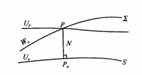

# 扰动位、大地水准面高和垂线偏差

## 扰动位

$$ T=W-U =V+Q-(V_0+Q)=V-V_0$$
它指空间同一点上$W$与$U$之差

## 大地水准面高

$$ N=-\frac{U_P-U_{P_0}}{\gamma_{P_0}}=-\frac{W_P-T_P-U_{P_0}}{\gamma_0}=-\frac{W_0-U_0}{\gamma_0}+\frac{T_0}{\gamma_0} \tag{1}$$
$$ N=\frac{T_0}{\gamma_0} (W_0=U_0)\tag{2}$$
$$ N=\frac{T_0}{\bar{\gamma_0}} (球近似)\tag{3}$$
上面的公式称为布隆斯公式

## 垂线偏差

定义：大地水准面上某点的重力方向与相应点的正常重力方向之间的夹角
