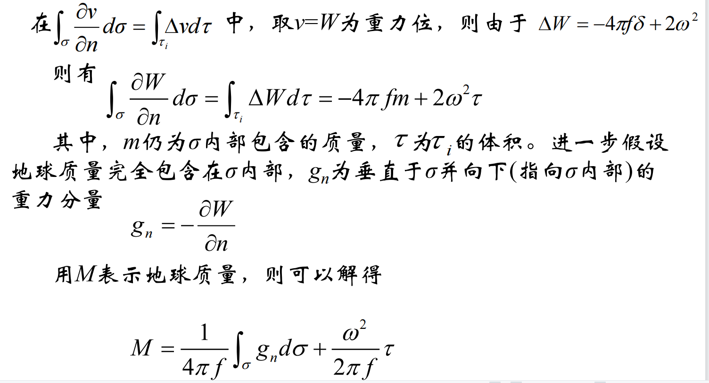

# 作业

[toc]

## 假设一个均质球壳（密度为常数δ）的中心位于坐标系原点，内外半径分别为b=1000km，a=2000km，试推导整个空间（提示：对于空间需分几种情况考虑）的引力位表达式

设某点到该球壳中心的距离为$\rho$则：
球面的外，内部引力位为
$$dV_e=4\pi f\mu \frac{R^2}{\rho}\\dV_i=4\pi f\mu R$$
且$\mu=\delta dR$,
则当$\rho$=<1000km时:
$$ V= \int_{1000}^{2000} 4\pi f\delta R \mathrm{d}R = 6000000 \pi \delta f$$
则当$\rho$>=2000km时:
$$ V= \int_{1000}^{2000} 4\pi f\delta \frac{R^2}{\rho} \mathrm{d}R = \frac{28000000000 \pi \delta f}{3 \rho}$$
则当1000km<$\rho$<2000km时:
$$ V=(\int_{1000}^{\rho} 4\pi f\delta \frac{R^2}{\rho} \mathrm{d}R) +(\int_{\rho}^{2000} 4\pi f \delta R \mathrm{d}R) = \frac{2 \pi \delta f (\rho (12000000 - \rho^{2}) - 2000000000)}{3 \rho}$$

## 证明外部第二边值问题解的唯一性

由外部第一格林公式可知：
$$\int_{\tau_e}^{} u \Delta v+\nabla \cdot u\nabla \cdot v  \mathrm{d}\tau =-\int_{\sigma}^{} u \frac{\partial v}{\partial n}\mathrm{d}\sigma$$
假设该解不唯一,存在不同的两个解$V_1,V_2$满足在面外部调和，无穷远处正则，满足第二边值问题的边界条件则：
$$\frac{\partial V_1}{\partial n}=\frac{\partial V_2}{\partial n}=f$$
则:
可知$T=V_1-V_2$也在面外部调和，在无穷远处正则
令$u=T,v=T$则：
$$\int_{\tau_e}^{}gradT\cdot gradT  \mathrm{d}\tau =-\int_{\sigma}^{} T \frac{\partial T}{\partial n}\mathrm{d}\sigma$$
$$ \frac{\partial T}{\partial n}=  \frac{\partial (V_1-V_2)}{\partial n}= \frac{\partial V_1}{\partial n}- \frac{\partial V_2}{\partial n}=0$$
则：
$$ \int_{\tau_e}^{}gradT\cdot gradT  \mathrm{d}\tau =\int_{\tau_e}^{}[(\frac{\partial T}{\partial x})^2+(\frac{\partial T}{\partial y})^2+(\frac{\partial T}{\partial z})^2] \mathrm{d}\tau = 0$$
此时要使积分恒为零，则：
$$ \frac{\partial T}{\partial x}=\frac{\partial T}{\partial y}=\frac{\partial T}{\partial z} =0$$
且$\sigma$外部$\tau_e$为常数，$T$沿三个轴的变化率都为零，
且$T$在无穷远处正则，即无穷远处为零，则在$\sigma$外部$ T=0，V_1=V_2$,与假设矛盾
所以外部第二边值问题解唯一

## 证明：若已知地球的形状、旋转角速度及面上的重力值，则理论上通过重力测量可以求出地球的质量

